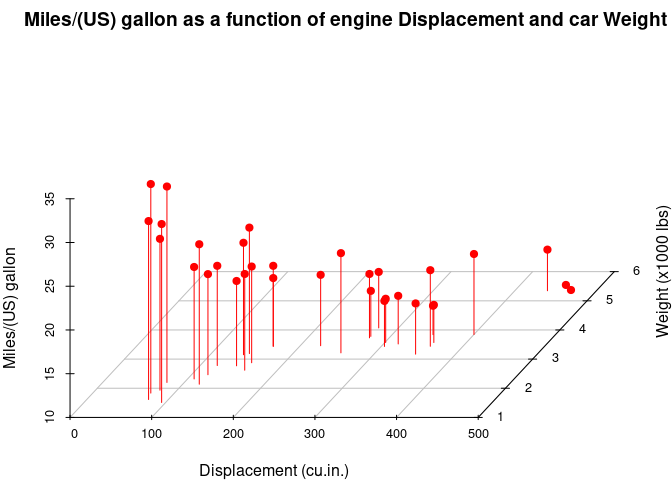
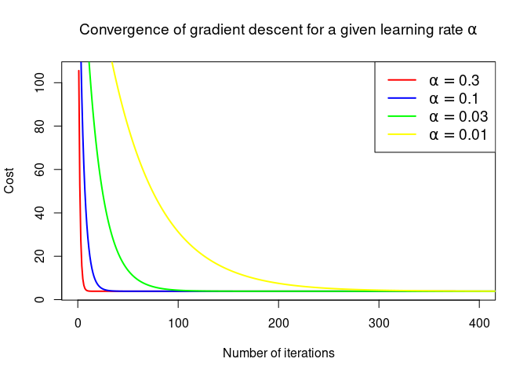
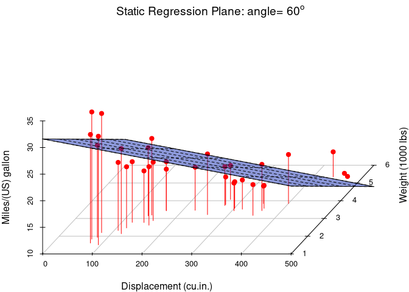

# [Multiple Linear Regression](https://julienatto.github.io/Linear_regression2/)

[https://julienatto.github.io/Linear_regression2/](https://julienatto.github.io/Linear_regression2/)


Multiple linear regression is a statistical method for finding a linear relationship between $n$ explanatory variables $X_1, X_2, \cdots, X_n$ $(n\geq 2)$ and a variable to be explained $y$:
\[y= \theta_0 + \theta_1 X_1 + \theta_2 X_2 + \cdots + \theta_n X_n.\]

# Data preparation and visualisation


The data **mtcars** in R package **datasets** was extracted from the 1974 Motor Trend US magazine, and comprises fuel consumption and 10 aspects of automobile design and performance for 32 automobiles (1973–74 models). We will use the following variables:

* mpg: Miles(US) gallon

* disp: Displacement (cu.in.)

* wt: Weight(100o lbs).


## Visualization of 10 rows chosen randomly among the 32 observations


```
##                      mpg  disp    wt
## Hornet Sportabout   18.7 360.0 3.440
## Valiant             18.1 225.0 3.460
## Merc 230            22.8 140.8 3.150
## Merc 450SE          16.4 275.8 4.070
## Cadillac Fleetwood  10.4 472.0 5.250
## Lincoln Continental 10.4 460.0 5.424
## Dodge Challenger    15.5 318.0 3.520
## Fiat X1-9           27.3  79.0 1.935
## Lotus Europa        30.4  95.1 1.513
## Volvo 142E          21.4 121.0 2.780
```


## Graph


<!-- -->

# Linear regresson using Gradient Descent
## Computation of the parameters

```
## [1] "alpha= 0.3 : Convergence realized after 376  iterations."
## [1] "alpha= 0.1 : Convergence realized after 1039  iterations."
## [1] "alpha= 0.03 : Convergence realized after 3105  iterations."
## [1] "alpha= 0.01 : Convergence realized after 8312  iterations."
```


<!-- -->


If we choose $\alpha=0.01$, then we have:


\[\theta=\begin{pmatrix} 34.9604612\\-0.0177253 \\-3.3507588 \end{pmatrix}\]

## Plotting the regression plane


<!-- -->


<!-- -->

## Predictions
* **Predict number of Miles/(US) gallon (mpg) for a Displacement of 300.0 cu.in. and a Weight of 4500 lbs** ($4.500\times 1000 lbs$):


$\qquad\quad$For a Displacement = 300 cu.in  and a Weight=4500 lbs, we predict **14.56** miles/(US) gallon (mpg).

\
&nbsp;

* **Predict number of Miles/(US) gallon (mpg) for a Displacement of 130.0 cu.in. and a Weight of 2650 lbs** ($2.650\times 1000 lbs$):


$\qquad\quad$For a Displacement = 130 cu.in  and a Weight=2650 lbs, we predict **23.78** miles/(US) gallon (mpg).

# Multiple Linear Regression using lm() function of R (Normal equation)

\[\theta=(X^TX)^{-1}X^Ty.\]


```
## 
## Call:
## lm(formula = mpg ~ disp + wt, data = mtcars)
## 
## Coefficients:
## (Intercept)         disp           wt  
##    34.96055     -0.01772     -3.35083
```

We can see that the values of the fitted parameters are $\hat{\theta_0}=34.96055, \quad\hat{\theta_1}=-0.01772$, and  $\hat{\theta_2}=-3.35083$.

## Summary of the model


```
## 
## Call:
## lm(formula = mpg ~ disp + wt, data = mtcars)
## 
## Residuals:
##     Min      1Q  Median      3Q     Max 
## -3.4087 -2.3243 -0.7683  1.7721  6.3484 
## 
## Coefficients:
##             Estimate Std. Error t value Pr(>|t|)    
## (Intercept) 34.96055    2.16454  16.151 4.91e-16 ***
## disp        -0.01773    0.00919  -1.929  0.06362 .  
## wt          -3.35082    1.16413  -2.878  0.00743 ** 
## ---
## Signif. codes:  0 '***' 0.001 '**' 0.01 '*' 0.05 '.' 0.1 ' ' 1
## 
## Residual standard error: 2.917 on 29 degrees of freedom
## Multiple R-squared:  0.7809,	Adjusted R-squared:  0.7658 
## F-statistic: 51.69 on 2 and 29 DF,  p-value: 2.744e-10
```


## Predictions
* **Predict number of Miles/(US) gallon (mpg) for a Displacement of 300.0 cu.in. and a Weight of 4500 lbs** ($4.500\times 1000 lbs$):


$\qquad\quad$For a Displacement = 300 cu.in  and a Weight=4500 lbs, we predict **14.56** miles/(US) gallon (mpg).

\
&nbsp;

* **Predict number of Miles/(US) gallon (mpg) for a Displacement of 130.0 cu.in. and a Weight of 2650 lbs** ($2.650\times 1000 lbs$):


$\qquad\quad$For a Displacement = 130 cu.in  and a Weight=2650 lbs, we predict **23.78** miles/(US) gallon (mpg).
